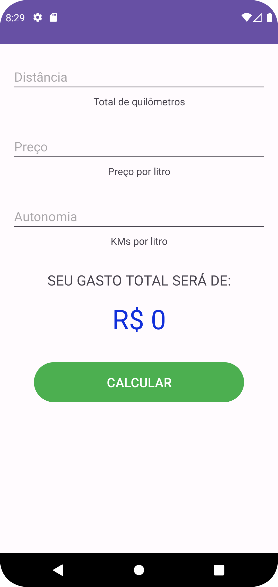
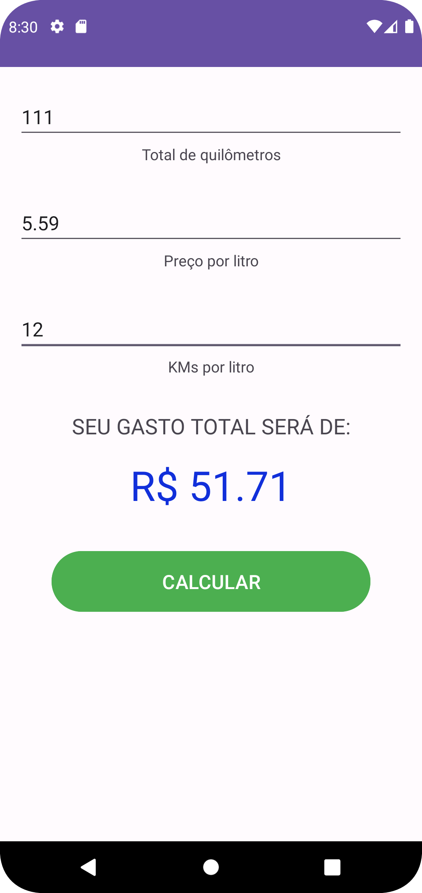

# GastoViagem - Calculadora de Gastos de uma Viagem

Bem-vindo ao GastoViagem, uma simples e eficiente calculadora de gastos de uma viagem desenvolvida em Kotlin para Android.

# Funcionalidades

O GastoViagem permite que os usuários calculem os gastos estimados de uma viagem com base em três parâmetros principais: distância a percorrer, preço do combustível e autonomia do veículo. As principais funcionalidades incluem:

- **Entrada de Dados:** Os usuários podem inserir a distância da viagem, o preço do combustível e a autonomia do veículo.
- **Cálculo Automático:** A aplicação realiza automaticamente o cálculo dos gastos estimados com base nos dados fornecidos.
- **Exibição Clara:** Os resultados são apresentados de forma clara e legível, facilitando a compreensão.

# Como Usar

1. Insira a distância total da viagem em quilômetros.
2. Informe o preço atual do combustível por litro.
3. Digite a autonomia do veículo em quilômetros por litro.

Após preencher esses campos, clique no botão "Calcular" para obter o custo estimado da viagem.

# Requisitos

Certifique-se de preencher todos os campos corretamente antes de clicar em "Calcular". Caso contrário, a aplicação exibirá uma mensagem indicando que todos os campos devem ser preenchidos.

# Capturas de Tela

# Contribuições

Sinta-se à vontade para contribuir para o desenvolvimento do GastoViagem. Se encontrar bugs, problemas de usabilidade ou tiver ideias para melhorias, abra uma issue ou envie um pull request.

# Licença

Este projeto é licenciado sob a MIT License - veja o arquivo LICENSE.md para detalhes.